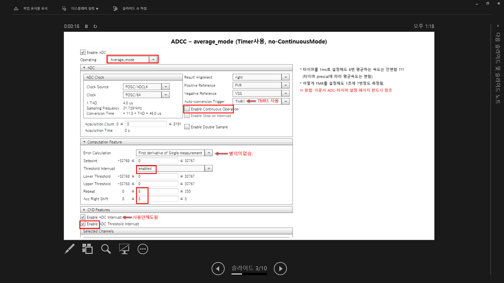
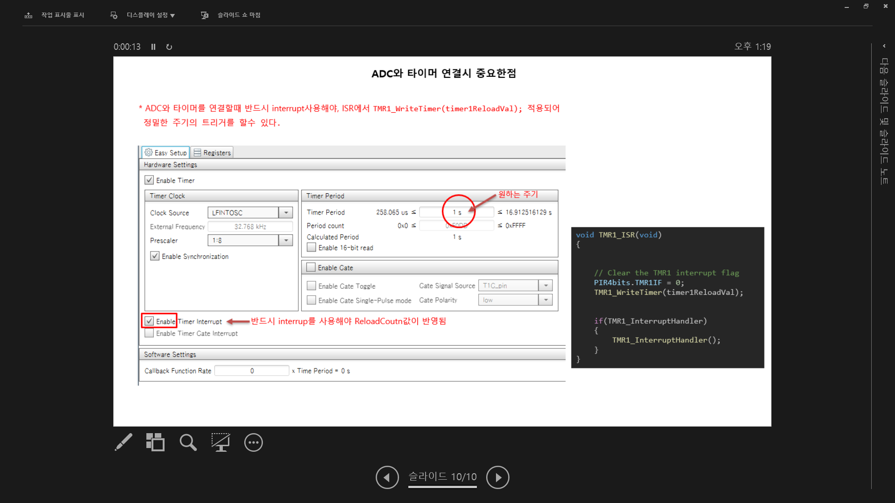
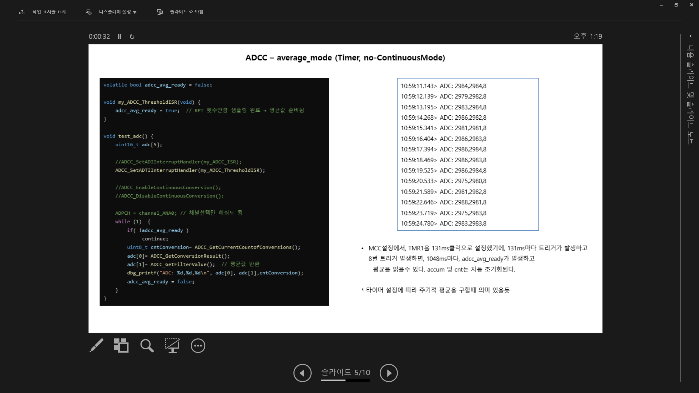

# PIC ADCC Average_Mode / Burst_Average_Mode Configuration and Test

PIC ADC Basic-Mode로 많이 사용했는데, 여러 문서를 보고, 기본적인 개념은 알아도 막상
Continuous Mode, Auto Trigger, ADC ComputationMode와 조합해서 설정하려면 너무 헷갈리고 복잡합니다.

따라서 이번에 테스트를 하면서 문서로 정리 해 둡니다.

## 결론:

예를들어 16번 평균낸다면, MCC에서 RPT=16, CRS=4(shift)로 설정

ADCC AverageMode: 타이머 주기마다, 트리거 되고, 16번주기로 평균이 얻어짐.

ADCC BurstAverageMode: 타이머 주기마다, 트리거 되고, 한번 트리거될때마다 16평균이 바로 얻어짐.

* AverageMode는 1초동안 16번 주기적 간격으로 측정한 평균값 낼때 유용하고,
* BurstAverageMode는 주기적으로 16번 순간평균을 낼때 유용할듯함.

  
## Screenshot 일부:

